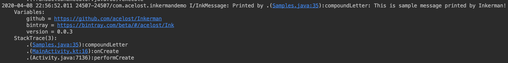

# Inkerman

[![Bintray][bintraybadge-svg]][bintray]

A strong debug logging library for Android developers. Inkerman has a simple and convenient api which allows you to compose readable debug logs in a builder style.

```java
public void compoundLetter() {
        Ink.message("This is", "sample message")
                .message("printed by")
                .message("Inkerman!")
                .variable("github", "https://github.com/acelost/Inkerman")
                .variable("bintray", "https://bintray.com/beta/#/acelost/Ink")
                .variable("version", "0.0.3")
                .trace(3)
                .print();
    }
```


## Integration
Add new dependency to your build.gradle file:
```groovy
implementation 'com.acelost.ink:ink:0.0.3'
```

## API

### Message

Use `message` method to specify main message:

```java
Source:

public void printHelloWorld() {
    Ink.message("Hello, world!").print(); // Simple message
}

Output:

Printed by .(Samples.java:8):printHelloWorld: Hello, world!
```
You can composite message from several parts:
```java
Source:

public void printFooBarBaz(String foo, Object bar, int baz) {
    Ink.message(foo, bar, baz).print(); // Composite message
}

Output:

Printed by .(Samples.java:12):printFooBarBaz: Hello, world! java.lang.Object@a4f33b5 42
```
or
```java
Source:

public printFooBarBaz(String foo, Object bar, int baz) {
    Ink.message(foo) // First part of message
        .message(bar) // Second part of message
        .message(baz) // Third part of message
        .print();
}

Output:

Printed by .(Samples.java:12):printFooBarBaz: Hello, world! java.lang.Object@a4f33b5 42
```
### Variable
Use `variable` method to print named value:
```java
Source:

public void printFooBarBaz(String foo, Object bar, int baz) {
    Ink.message("Values of classic variables") // List of variables
        .variable("foo", foo)
        .variable("bar", bar)
        .variable("baz", baz)
        .print();
}

Output:

Printed by .(Samples.java:20):printFooBarBazVariables: Values of classic variables 
    Variables:
    	foo = Hello, world!
    	bar = java.lang.Object@8785a4a
    	baz = 42
```
### Trace
Use `trace` method to print trace of logging call:
```java
Source:

public void printWhereAmIFrom() {
    Ink.trace(10).print(); // Print ten call trace
}

Output:

Printed by .(Samples.java:24):printWhereAmIFrom: 
    StackTrace(10):
    	.(Samples.java:24):printWhereAmIFrom
    	.(MainActivity.kt:15):onCreate
    	.(Activity.java:7136):performCreate
    	.(Activity.java:7127):performCreate
    	.(Instrumentation.java:1272):callActivityOnCreate
    	.(ActivityThread.java:2905):performLaunchActivity
    	.(ActivityThread.java:3060):handleLaunchActivity
    	.(LaunchActivityItem.java:78):execute
    	.(TransactionExecutor.java:108):executeCallbacks
    	.(TransactionExecutor.java:68):execute
```


## License

    Copyright 2019 The Spectrum Author

    Licensed under the Apache License, Version 2.0 (the "License");
    you may not use this file except in compliance with the License.
    You may obtain a copy of the License at

       http://www.apache.org/licenses/LICENSE-2.0

    Unless required by applicable law or agreed to in writing, software
    distributed under the License is distributed on an "AS IS" BASIS,
    WITHOUT WARRANTIES OR CONDITIONS OF ANY KIND, either express or implied.
    See the License for the specific language governing permissions and
    limitations under the License.

[bintray]: https://bintray.com/acelost/Ink/ink
[bintraybadge-svg]: https://img.shields.io/bintray/v/acelost/Ink/ink.svg